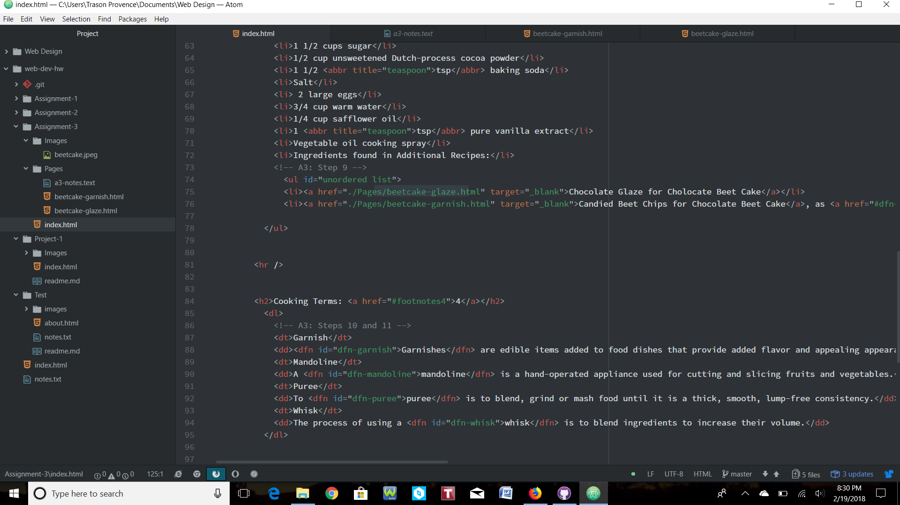

# My Assignment-4 Readme

In a webpage, there are elements associated with the head and elements associated with the body. The head includes all of the metadata and tells the processor information such as the who the author of the document is or when it was published or even what the title is. As I said earlier, there is metadata in the head, which is just empty data. This can include the charset, description and author, which all give the page information and can't be seen by the user. Within the metadata, there can be a viewport, which tells the page how to control its scales and dimensions. The title is a huge part in the head because it's not only the title of the webpage, but it's also what's seen when added to one's favorites and in search-engine logs. Lastly, there is style and link. If there are links present in the code, this means that the webpage will need to load extra sources. Now, there is also the elements in the body. The body is where all of the insides of a webpage are stored, and is also the information that pops up on one's computer. In the body, there are two different types of markup: structural and semantic.

Structural markup is what stores information about how a document is set-up. There are headings, breaks, lists and paragraphs that get qualified under structure. With these elements, users of the site will be able to be helped with visuals about the content of the page. On the other hand, semantic markup is the language used to give meaning to a document. With semantic markup, one could place emphasis on a single word or a phrase and make words strong and even commit strikethroughs.

For this work cycle, I made sure to start by reading through all of the information and participating in some of the todo's so that I would better understand the assignment in front of me. After going through everything, I created a new repo and started reading the directions for Part 1: Assignment. I made sure that I had every document open (index, beetcake-garnish, beetcake-glaze) so that I could make all of the changes at the same time when it came to declaring a type and inserting titles. Step-by-step I went through page and made sure I went back to the information in the Topic 04 Overview page if I got caught up on things, which definitely happened. I was having trouble figuring out how to superscript the numbers, and I couldn't figure it out. I tried messing with the code at the top of the page, typing 1 and the <a href> that was provided.

