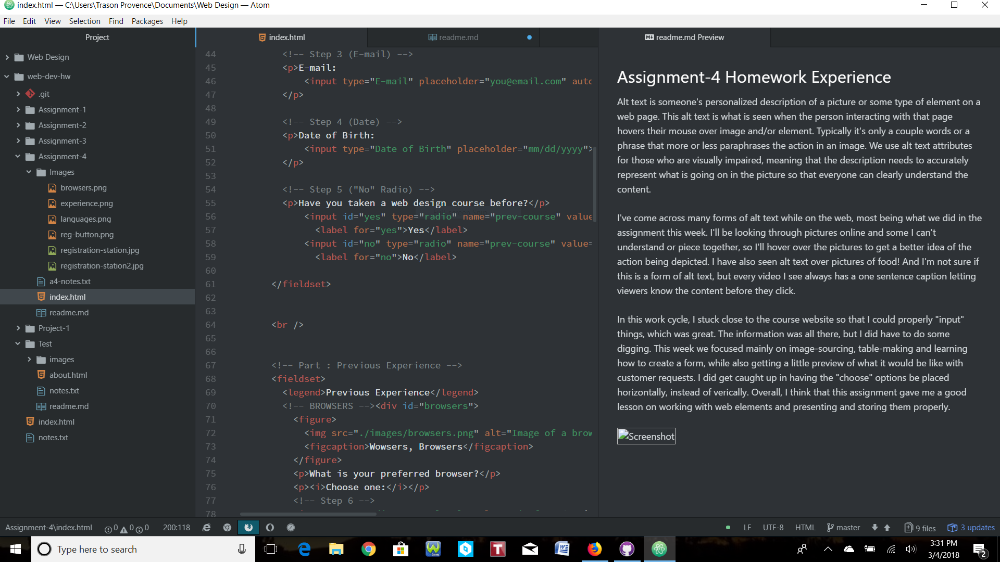

## Assignment-4 Homework Experience

Alt text is someone's personalized description of a picture or some type of element on a web page. This alt text is what is seen when the person interacting with that page hovers their mouse over image and/or element. Typically it's only a couple words or a phrase that more or less paraphrases the action in an image. We use alt text attributes for those who are visually impaired, meaning that the description needs to accurately represent what is going on in the picture so that everyone can clearly understand the content.

I've come across many forms of alt text while on the web, most being what we did in the assignment this week. I'll be looking through pictures online and some I can't understand or piece together, so I'll hover over the pictures to get a better idea of the action being depicted. I have also seen alt text over pictures of food! And I'm not sure if this is a form of alt text, but every video I see always has a one sentence caption letting viewers know the content before they click.

In this work cycle, I stuck close to the course website so that I could properly "input" things, which was great. The information was all there, but I did have to do some digging. This week we focused mainly on image-sourcing, table-making and learning how to create a form, while also getting a little preview of what it would be like with customer requests. I did get caught up in having the "choose" options be placed horizontally, instead of verically. Overall, I think that this assignment gave me a good lesson on working with web elements and presenting and storing them properly.

