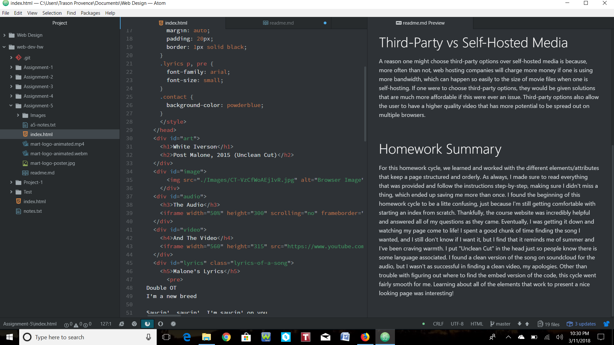

## Assignment-5 Homework Experience

# The Attributes
The ID attribute, also known as the Global Attribute, is the attribute that assigns "unique identifiers" to the element, and it should never be the same, meaning the identification given to one element should be different from every other element. These "unique identifiers" are in the value of strings. Unlike most elements that have structural and semantic purposes, div elements are the ones that really don't have that capability, but still provide structure. These type of elements add order to the structure of the page by grouping other elements together, which, in turn, adds to the overall readability of the page. Like ID elements, the class attribute an identifier, but for grouping other elements together by using the same unique name value. Lastly, the span element works to identify or group content together that requires organization or extra styling. It's known as the inline equivalent of the div elements because it can exist within them and not create extra blocks.

# Third-Party vs Self-Hosted Media
A reason one might choose third-party options over self-hosted media is because, more often than not, web hosting companies will charge more money if one is using more bandwidth, which can happen so easily to the size of movie files when one is self-hosting. If one were to choose third-party options, they would be given solutions that are much more affordable if this were ever an issue. Third-party options also allow the user to have a higher quality video that has more potential to be spread out on multiple browsers.

# Homework Summary
For this homework cycle, we learned and worked with the different elements/attributes that keep a page structured and orderly. As always, I made sure to read everything that was provided and follow the instructions step-by-step, making sure I didn't miss a thing, which ended up saving me more than once. I found the beginning of this homework cycle to be a litte confusing, just because I'm still getting comfortable with starting an index from scratch. Thankfully, the course website was incredibly helpful and answered all of my questions as they came. Eventually, I was getting it down and watching my page come to life! I spent a good chunk of time finding the song I wanted, and I still don't know if I want it, but I find that it reminds me of summer and I've been craving warmth. I put "Unclean Cut" in the head just so people know there is some language associated. I found a clean version of the song on soundcloud for the audio, but I wasn't as successful in finding a clean video, my apologies. Other than trouble with figuring out where to find the embed version of the code, this cycle went fairly smooth for me. Learning about all of the elements that work to present a nice looking page was interesting!

