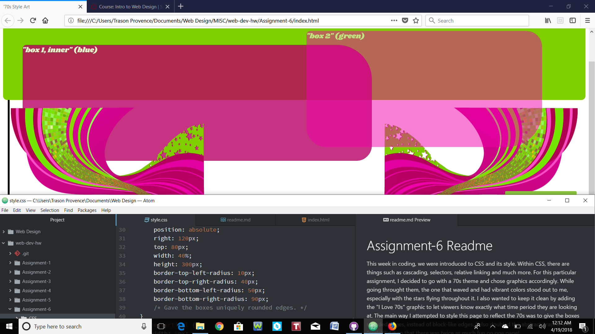

# Assignment-6 Readme

This week in coding, we were introduced to CSS and its style. Within CSS, there are things such as cascading, selectors, relative linking and much more. For this particular assignment, I decided to go with a 70s theme and chose graphics accordingly. While going throught them, the one that waved and had vibrant colors stood out to me, especially with the stars flying throughout it. I also wanted to keep it clean by adding the "I Love 70s" graphic to let viewers know exactly what time period they are looking at. The main way I attempted to style this page to reflect the 70s was to give the boxes rounded edges, instead of block-like edges. I also doubled the abstract graphic and "scaleX"'d it so that there was twice as much fun on one page!

For the color palette, I chose #7fcf00, #b80063 and #ef00aa, which were pretty much the only colors I had to choose from, but I think they make the page look more colorful and 70s. To be honest, this assignment wasn't easy for me. Like usual, I read all (most) of the material and dove into the steps and followed them word by word. I started running into problems when it came to matching the html and css documents up. Even though we linked them early in the lesson, I was confused on the idea that if one thing was done to one, it affected the other. I was puzzled enough that I asked for help in office hours, and it made a world of a difference. Getting the hands-on, one-on-one interaction really helped me understand and even got me out of my comfort zone a little bit to get more creative with code. I'm looking forward to getting more familiar with CSS.

