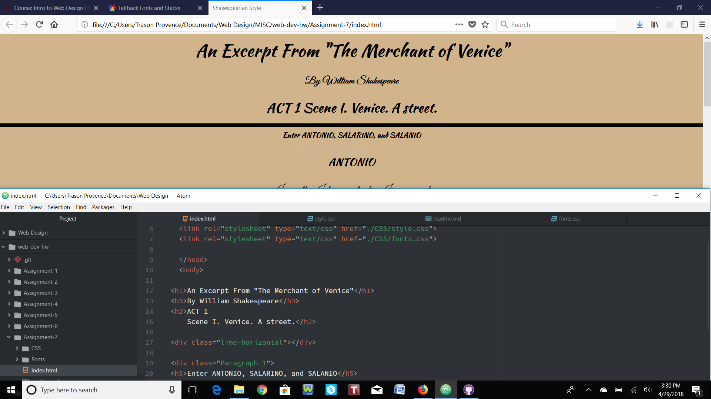

# Assignment-7: Typography

For this assignment, we learned about texts and fonts and how websites look the
best, and most clean, when they have outstanding written elements. The approach
I took was to download all of the resources provided and go with a font name that
sounded familiar, so I went with Shakespeare (mostly because I'm big into history
and Shakespeare is a well-known historical figure). Knowing I was going with an
older style, I wanted to include the use of cursive writing, just as Shakespeare
himself may have written it. The Great+Vibes font, to me, captured the older style
of writing. Next, I decided to choose Kaushan Script to give the webiste a look
similar to what screenplays may have looked like back in the day. I also wanted
the main headings to be more legible, while the dialogue was more complex.

System fonts are those that are already installed on one's local device and system,
whereas web fonts are those that are custom made and hosted on a server. Due to
licensing, system fonts aren't always available to the web. As for web fonts, they
require certain elements to be pulled up and don't have to be available on the user's
device to appear. Around 65 percent of websites currently practice the use of web fonts,
but there are things to take into consideration when using them, such as:  browser
compatibility, rendering speeds and availability. Lastly, we have web-safe fonts, which
are those people can rely on being available by the system, meaning both Mac and
Windows users should have them.

Fallback fonts, or a font stack, are important because, if the primary font should
fail or not load for some reason, then the primary will try to boot back up to take
its place. The font-family property should include the primary font choice, just
in case this ever occurs.

This work cycle had me scratching my head a couple times, if I'm being honest. Just
like I start every other assignment, I read through the course website information
and absorbed as much as I could. I then created all of the files from scratch and
referenced the page if and when I needed to. I'm pretty sure I got everything requested
of me and I was pretty happy with the overrall product. I changed the background color
to tan to give it a scroll-look, and center-aligned the text to put it in its time.
In the end, I learned a lot about typography and its importance.

