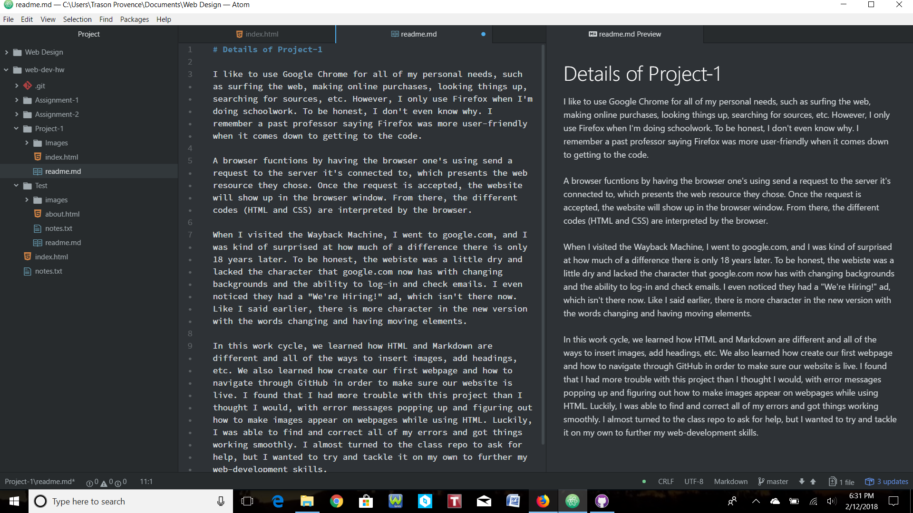

# Details of Project-1

I like to use Google Chrome for all of my personal needs, such as surfing the web, making online purchases, looking things up, searching for sources, etc. However, I only use Firefox when I'm doing schoolwork. To be honest, I don't even know why. I remember a past professor saying Firefox was more user-friendly when it comes down to getting to the code.

A browser fucntions by having the browser one's using send a request to the server it's connected to, which presents the web resource they chose. Once the request is accepted, the website will show up in the browser window. From there, the different codes (HTML and CSS) are interpreted by the browser.

When I visited the Wayback Machine, I went to google.com, and I was kind of surprised at how much of a difference there is only 18 years later. To be honest, the webiste was a little dry and lacked the character that google.com now has with changing backgrounds and the ability to log-in and check emails. I even noticed they had a "We're Hiring!" ad, which isn't there now. Like I said earlier, there is more character in the new version with the words changing and having moving elements.

In this work cycle, we learned how HTML and Markdown are different and all of the ways to insert images, add headings, etc. We also learned how create our first webpage and how to navigate through GitHub in order to make sure our website is live. I found that I had more trouble with this project than I thought I would, with error messages popping up and figuring out how to make images appear on webpages while using HTML. Luckily, I was able to find and correct all of my errors and got things working smoothly. I almost turned to the class repo to ask for help, but I wanted to try and tackle it on my own to further my web-development skills.

