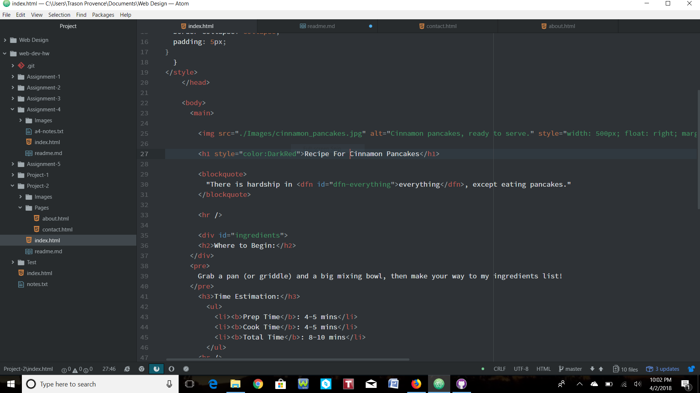

# Project-2 Experience

For this write-up, I'll be talking about HTML. To be quite honest, learning this was one of the hardest concepts I've had to wrap my head around, and I still don't know if I have even half of the material down. I'm a beginning web-designer/developer and learning the code and structure of a webpage is a feat in its own, in my opinion. I have been enjoying this class a bunch just because I think it's interesting how a webpage works, and not just what format was used, but how it really works right down to the code. There were times where I walked away from my computer because I was so stumped, but, with the help of the interactive websites, I was always able to find my mistake and make the function run like it was intended to do. To me, the most difficult things to get down while learning HTML is adding navigational code to get from one directory to another. I definitely had the most problems with this and still haven't quite figured it all out.

I'm excited to dive into CSS and learn about how it "decorates" HTML. I assume it means that it helps with the style and how the code appears on the site, and I think that will be interesting and useful to learn! I also have a feeling that it might be kind of tough. I think I'm just most anxious about learning new code when I was starting to get comfortable with the other.

In this work cycle, we were assigned to create a 3-page instructable website based off of our knowledge on HTML and semantic mark-up. For this particular assignment, I relied on looking at a bunch, if not most, of my previous index's. I did this so that I could easily look at what I did and how it worked and implement that into this project, but with different parameters and on a different scale. We worked with getting images, embedded media, structural and semantic mark-up, and much more into a working website. To be honest, I ran into a huge problem with the <nav> element. No matter what I tried and how many directories I tried to pass using ".", I just couldn't get it. I even tried talking with a classmate and got some tips, but still couldn't make it work. For some reason, it is saying the file can't be found and I just don't know what else to do. It shows them all there on the page and works fully on the index, but I'm lost. Other than that, I think that this project went smoothly, and it felt so nice to feel like I'm actually understanding the material and being able to do code without referencing the course website.

